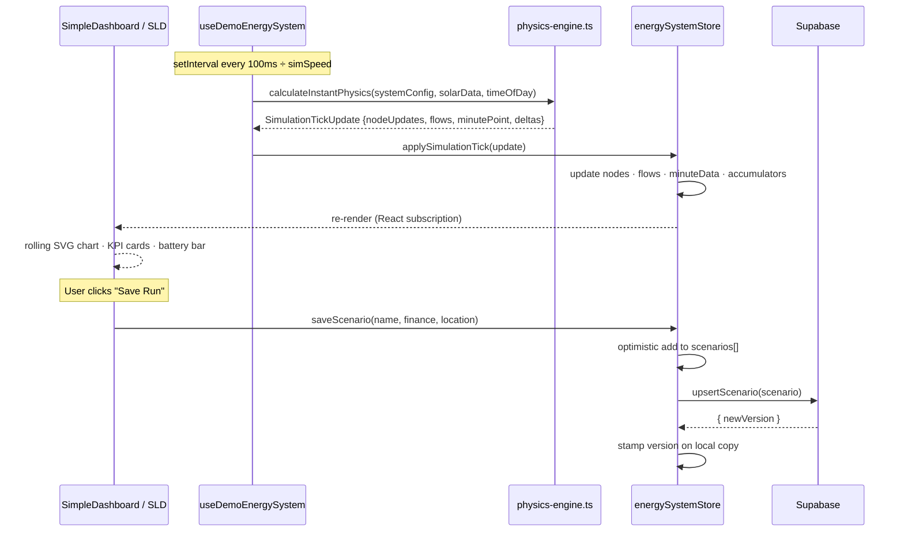

# SafariCharge


<!-- AUTO-UPDATED: do not edit this block manually -->
| | |
|---|---|
| **Last commit** | [`unknown`](https://github.com/rauell1/safaricharge/commit/) by unknown |
| **Date** | unknown |
| **Message** |  |
| **Total commits** | ? |
| **TypeScript files** | ? |
<!-- END AUTO-UPDATED -->


**SafariCharge** is a production-grade solar PV + BESS simulation, parametric sizing, and MILP dispatch optimisation platform built for Kenya and East Africa. It combines real-time physics simulation, hardware-accurate component catalogs, KPLC tariff modelling, and 25-year financial analysis — all in a Next.js 16 App Router application deployed on Vercel with Supabase as the backend.

---

## Architecture

```mermaid
flowchart TD
    subgraph Browser["Browser — React 19 / Next.js App Router"]
        direction TB

        subgraph Routes["Page Routes"]
            LAND["/landing\nMarketing"]
            LOGIN["/login · /signup\nSupabase Auth"]
            DEMO["/demo\nSimulation Dashboard"]
            SIZING["/sizing\nParametric Sizing Engine"]
            DASH["/dashboard\nAuthenticated Workspace"]
            ADMIN["/admin\nAdmin Panel"]
            EI["/energy-intelligence\nAI Insights"]
        end

        subgraph SimLayer["Simulation Layer"]
            direction TB
            SIMPLE["SimpleDashboard\n(rolling SVG chart, KPI cards,\nLoadProfilePicker, speed controls)"]
            ADVANCED["Advanced View\n(SLD · ValidationPanel\n· SizingDispatchPanel)"]
            TOGGLE["useUserPreference\n'sc_sim_view_mode'\nsimple | advanced"]
        end

        subgraph Store["Zustand Store — energySystemStore"]
            direction LR
            SC["systemConfig\n(solarKW · batteryKWh · inverterKW\n· systemMode · loadProfile)"]
            LOC["activeLocation\n(AFRICA_CITIES)"]
            MD["minuteData[]\n(rolling 420×30 pts)"]
            ACC["accumulators\n(solar · savings · gridImport\n· carbonOffset · feedIn)"]
            SCEN["scenarios[]\n(optimistic Supabase sync)"]
        end

        subgraph TickLoop["Simulation Tick Loop"]
            DEMO_HOOK["useDemoEnergySystem\n420 ticks/day\nBASE_INTERVAL=100ms"]
            PHYS_HOOK["usePhysicsSimulation"]
            PHYS_ENG["physics-engine.ts\ncalculateInstantPhysics()"]
            SUBENG["solarEngine · batteryEngine\ngridEngine · evMobilityEngine"]
        end

        subgraph SizingEng["Parametric Sizing Engine"]
            CALC["solarCalculator.ts\nrunSimulation()"]
            CATALOG["mockData.ts\nINVERTER_CATALOG\nPANEL_CATALOG\nBATTERY_CATALOG\nKSH_PER_USD = 127.5"]
            BRIDGE["SizingDispatchPanel\nbuildInputs() bridge"]
        end
    end

    subgraph Backend["Backend — Next.js API Routes"]
        AI_API["/api/safaricharge-ai\nGemini → Z.AI fallback"]
        SC_API["/api/scenarios\n/api/simulation"]
        OPT_API["/api/optimize\n/api/forecast"]
        EXP_API["/api/export-report\n/api/formal-report"]
    end

    subgraph PythonSvcs["Python Microservices"]
        FORECAST["forecasting/\npv_load_service\n(solar + load forecaster)"]
        OPTIMIZER["python/optimizer_service\n(MILP dispatch optimiser)"]
        VALIDATION["python/validation_service\n(pvlib + SAM cross-check)"]
    end

    subgraph Data["Data Layer — Supabase (PostgreSQL)"]
        direction LR
        TABLES["scenarios\nsimulation_runs\nsimulation_data_points\nuser_preferences\nprofiles"]
        SIZING_TABLES["sizing_projects\nsizing_project_inputs\nsizing_project_results\nsizing_simulation_logs"]
    end

    subgraph Infra["Infrastructure"]
        VERCEL["Vercel\nsc-solardashboard"]
        GH["GitHub Actions\nCI · auto-docs bots\n(README · codebase map · rollback log)"]
        SUPABASE_AUTH["Supabase Auth\nmagic links + session cookies"]
    end

    %% Auth flow
    LOGIN --> SUPABASE_AUTH
    SUPABASE_AUTH --> DASH

    %% Routing
    DEMO --> SimLayer
    TOGGLE --> SIMPLE
    TOGGLE --> ADVANCED

    %% Tick loop chain
    DEMO_HOOK --> PHYS_HOOK --> PHYS_ENG --> SUBENG
    PHYS_ENG --> Store

    %% Sizing bridge
    ADVANCED --> BRIDGE
    BRIDGE --> CALC
    CALC --> CATALOG

    %% API calls
    DEMO --> SC_API
    EI --> AI_API
    DASH --> SC_API
    AI_API -->|"Gemini 1.5 Pro\nglm-5-turbo fallback"| AI_API
    OPT_API --> OPTIMIZER
    OPT_API --> FORECAST

    %% Data
    SC_API --> TABLES
    SIZING --> SIZING_TABLES
    Store --> SCEN --> TABLES

    %% Infra
    Browser --> VERCEL
    Backend --> VERCEL
    VERCEL --> GH
    Backend --> Data
    Backend --> PythonSvcs
```



---

## System Data Flow — Simulation Tick



---

## Tech Stack

| Layer | Technology |
|---|---|
| Framework | Next.js 16.2 (App Router, Turbopack) |
| Language | TypeScript 5.9 |
| UI | React 19 · Tailwind CSS v4 · shadcn/ui + Radix UI |
| State | Zustand v5 · TanStack Query v5 |
| Validation | Zod v4 |
| Database / Auth | Supabase (PostgreSQL + magic-link auth) |
| Animation | Framer Motion |
| Charts | Recharts · custom SVG |
| AI | Google Gemini 1.5 Pro (primary) → Z.AI glm-5-turbo (fallback) |
| Python services | FastAPI · pvlib · PuLP (MILP optimizer) |
| Deployment | Vercel (standalone Next.js) |
| CI | GitHub Actions |

---

## Core Features

### Real-Time Physics Simulation
- **420 ticks per simulated day** at 100 ms base interval — configurable 1× / 5× / 10× / 30× speed
- Solar irradiance model with temperature derating (`−0.29 %/°C`, Jinko TOPCon N-type)
- Dyness battery SoC management with configurable DoD and round-trip efficiency
- KPLC peak/off-peak tariff logic (17:00–21:00 evening peak)
- EV charging fleet simulation (AC Type 2 through 350 kW DC Hypercharger)
- Grid outage / islanding mode toggle

### Simple vs Advanced Dashboard
- **Simple mode** — clean KPI cards, rolling 60-point SVG chart, `LoadProfilePicker` (Residential / Commercial / Industrial / Off-Grid Lodge), city quick-chips
- **Advanced mode** — full single-line diagram (SLD), `ValidationPanel`, `SizingDispatchPanel` with 24 h dispatch chart, cable sizing table, and CapEx/NPV strip
- Mode persisted via `useUserPreference` to localStorage + Supabase

### Parametric Sizing Engine (`/sizing`)
- Two-column layout: sticky inputs panel (420 px) + live results
- 300 ms debounced `runSimulation()` on every input change
- **IEC 60364-5-52 cable sizing** — Method C, ampacity + voltage-drop, 1–4 parallel runs
- **Financial model** — NPV, IRR (secant method), LCOE, 25-year cash flows, grid tariff escalation
- Dyness battery architecture auto-selected by kWh: LV48 (≤51.2 kWh), Stack100 (≤200 kWh), Stack280 (otherwise)
- `KSH_PER_USD = 127.5` (May 2026 exchange rate)

### Hardware-Accurate Component Catalogs

| Component | Catalog Spec |
|---|---|
| **Jinko Tiger Neo 580 W** (default panel) | 23.14 % eff · −0.29 %/°C · 0.40 %/yr degradation · bifacial gain |
| **Deye SG05LP3** (3–20 kW, 3-phase) | 97.6 % peak · >99 % MPPT · 800 V PV input |
| **Deye SG04LP1** (3.6–6 kW, 1-phase) | 97.6 % peak · >99 % MPPT · 500 V PV input |
| **Dyness Stack100** (100 kWh) | LFP · stackable to 200 kWh |
| **Dyness Stack280** (280 kWh) | LFP · large commercial |
| **Dyness LV48** (≤51.2 kWh) | Low-voltage residential |

### Africa-Focused Location Data
- `AFRICA_CITIES` dataset covering Kenya, Nigeria, South Africa, Egypt, and more
- Per-city: `avgDailyPsh`, `annualGHI`, `avgTempC`, `elevation`, `region`
- 47 Kenya county irradiance presets from measured data
- `activeLocation` in Zustand drives solar yield calculations for every simulation tick

### AI Assistant
- Server-side endpoint at `/api/safaricharge-ai`
- Gemini 1.5 Pro primary; Z.AI `glm-5-turbo` automatic fallback
- Contextualised on system config, accumulators, and active scenario

### Financial & Reporting
- 25-year NPV / IRR / LCOE / ROI with degradation model
- One-click HTML → PDF report (6 sections, SVG charts)
- Export modal with scenario comparison

---

## Getting Started

```bash
git clone <repo>
cd safaricharge
npm install
cp .env.example .env          # fill in Supabase URL + anon key
npm run dev                   # http://localhost:3000
```

Apply Supabase migrations:

```bash
supabase db push              # or paste migration files in Supabase dashboard SQL editor
npm run seed                  # optional: seed demo data
```

---

## Commands

| Command | Purpose |
|---|---|
| `npm run dev` | Dev server on port 3000 (Turbopack) |
| `npm run build` | Production build (standalone output) |
| `npm run typecheck` | `tsc --noEmit` (filter `.next/` noise with `\| grep -v '\.next'`) |
| `npm run lint` | ESLint |
| `npm run test` | Vitest (run once) |
| `npm run test:watch` | Vitest watch mode |
| `npm run seed` | Seed Supabase with demo data |

---

## Environment Variables

| Variable | Required | Purpose |
|---|---|---|
| `NEXT_PUBLIC_SUPABASE_URL` | Yes | Supabase project URL |
| `NEXT_PUBLIC_SUPABASE_ANON_KEY` | Yes | Supabase anon key |
| `SUPABASE_SERVICE_ROLE_KEY` | Recommended | Server-side admin operations |
| `GEMINI_API_KEY` | Optional | AI assistant — Gemini primary |
| `ZAI_API_KEY` | Optional | AI assistant — Z.AI fallback |
| `ADMIN_EMAIL` / `ADMIN_EMAILS` | Optional | Comma-separated admin emails |
| `ADMIN_PASSWORD` | Optional | Auto-seeded admin password |
| `ADMIN_SESSION_SECRET` | Optional | HMAC secret for admin cookie |

---

## Project Structure

```
src/
├── app/                        # Next.js App Router pages + API routes
│   ├── demo/page.tsx           # Main simulation dashboard (Simple/Advanced toggle)
│   ├── sizing/page.tsx         # Parametric sizing engine
│   ├── dashboard/page.tsx      # Authenticated workspace
│   └── api/                   # Server-side API routes
├── components/
│   ├── simulation/             # SimpleDashboard, SizingDispatchPanel, LoadProfilePicker
│   ├── sizing/                 # ParametricInputs, SimulationResults, ProposalViewer
│   ├── dashboard/              # KPI cards, power flow, charts
│   └── ui/                    # shadcn/Radix primitives
├── hooks/
│   ├── useDemoEnergySystem.ts  # Simulation tick loop driver
│   ├── usePhysicsSimulation.ts # Physics engine integration
│   └── useUserPreference.ts   # localStorage + Supabase preference sync
├── lib/
│   ├── physics-engine.ts       # Core energy-balance engine (use this — not src/simulation/)
│   ├── physics-engine-bridge.ts
│   ├── sizing/
│   │   ├── solarCalculator.ts  # runSimulation() — IEC cable sizing + financial model
│   │   └── mockData.ts         # Hardware catalogs (inverters, panels, batteries)
│   ├── africa-locations-data.ts # AFRICA_CITIES canonical city list
│   └── supabase.ts / supabase-server.ts
├── stores/
│   └── energySystemStore.ts   # Zustand — single source of truth
supabase/migrations/            # SQL migrations (sizing_ prefix for new tables)
python/                         # MILP optimizer + validation microservices
forecasting/                    # PV + load forecast service
```

> **Note:** `src/simulation/` is a legacy directory retained for reference only. Do not import from it — use `src/lib/physics-engine.ts` and `src/lib/physics-engine-bridge.ts` instead.

---

## Database Schema

**Existing tables** (no prefix): `scenarios`, `simulation_runs`, `simulation_data_points`, `user_preferences`, `profiles`

**Sizing engine tables** (`sizing_` prefix):

```sql
sizing_projects          -- named sizing projects per user
sizing_project_inputs    -- SimulationInputs JSON snapshot
sizing_project_results   -- SimulationResults JSON snapshot
sizing_simulation_logs   -- per-run audit log
```

All tables have RLS enabled with user-scoped policies.

---

## Deployment

Hosted on **Vercel** (project `sc-solardashboard`). Auto-doc bots commit README, codebase map, and rollback log on every push — always `git pull --rebase` before pushing if CI has committed since your last pull.

<!-- deploy: trigger -->
